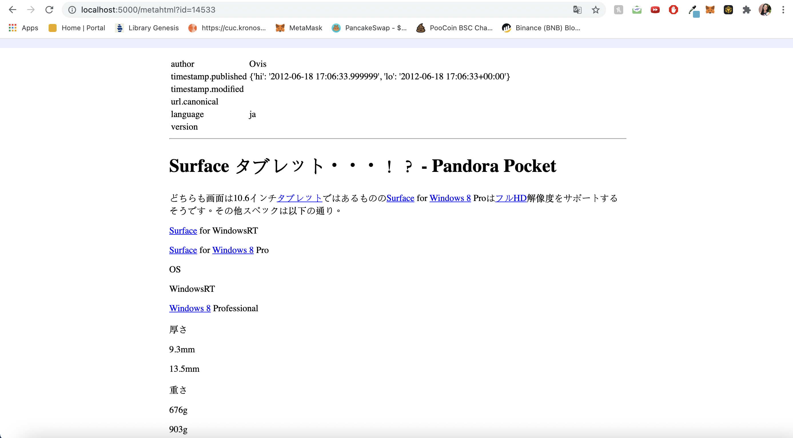
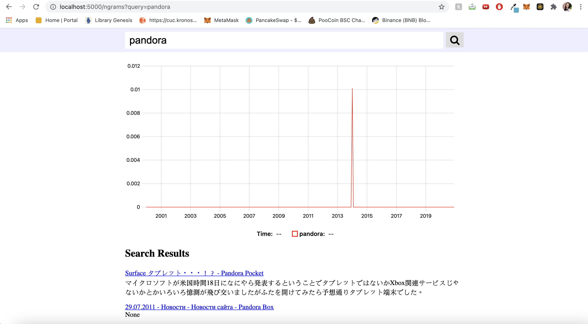

# HW: Search Engine

In this assignment you will create a highly scalable web search engine.

**Due Date:** Sunday, 9 May

**Learning Objectives:**
1. Learn to work with a moderate large software project
1. Learn to parallelize data analysis work off the database
1. Learn to work with WARC files and the multi-petabyte common crawl dataset
1. Increase familiarity with indexes and rollup tables for speeding up queries

## Task 0: project setup

1. Fork this github repo, and clone your fork onto the lambda server

1. Ensure that you'll have enough free disk space by:
    1. bring down any running docker containers
    1. run the command
       ```
       $ docker system prune
       ```

## Task 1: getting the system running

In this first task, you will bring up all the docker containers and verify that everything works.

There are three docker-compose files in this repo:
1. `docker-compose.yml` defines the database and pg_bouncer services
1. `docker-compose.override.yml` defines the development flask web app
1. `docker-compose.prod.yml` defines the production flask web app served by nginx

Your tasks are to:

1. Modify the `docker-compose.override.yml` file so that the port exposed by the flask service is different.

1. Run the script `scripts/create_passwords.sh` to generate a new production password for the database.

1. Build and bring up the docker containers.

1. Enable ssh port forwarding so that your local computer can connect to the running flask app.

1. Use firefox on your local computer to connect to the running flask webpage.
   If you've done the previous steps correctly,
   all the buttons on the webpage should work without giving you any error messages,
   but there won't be any data displayed when you search.

1. Run the script
   ```
   $ sh scripts/check_web_endpoints.sh
   ```
   to perform automated checks that the system is running correctly.
   All tests should report `[pass]`.

## Task 2: loading data

There are two services for loading data:
1. `downloader_warc` loads an entire WARC file into the database; typically, this will be about 100,000 urls from many different hosts. 
1. `downloader_host` searches the all WARC entries in either the common crawl or internet archive that match a particular pattern, and adds all of them into the database

### Task 2a

We'll start with the `downloader_warc` service.
There are two important files in this service:
1. `services/downloader_warc/downloader_warc.py` contains the python code that actually does the insertion
1. `downloader_warc.sh` is a bash script that starts up a new docker container connected to the database, then runs the `downloader_warc.py` file inside that container

Next follow these steps:
1. Visit https://commoncrawl.org/the-data/get-started/
1. Find the url of a WARC file.
   On the common crawl website, the paths to WARC files are referenced from the Amazon S3 bucket.
   In order to get a valid HTTP url, you'll need to prepend `https://commoncrawl.s3.amazonaws.com/` to the front of the path.
1. Then, run the command
   ```
   $ ./download_warc.sh $URL
   ```
   where `$URL` is the url to your selected WARC file.
1. Run the command
   ```
   $ docker ps
   ```
   to verify that the docker container is running.
1. Repeat these steps to download at least 5 different WARC files, each from different years.
   Each of these downloads will spawn its own docker container and can happen in parallel.

You can verify that your system is working with the following tasks.
(Note that they are listed in order of how soon you will start seeing results for them.)
1. Running `docker logs` on your `download_warc` containers.
1. Run the query
   ```
   SELECT count(*) FROM metahtml;
   ```
   in psql.
1. Visit your webpage in firefox and verify that search terms are now getting returned.

### Task 2b

The `download_warc` service above downloads many urls quickly, but they are mostly low-quality urls.
For example, most URLs do not include the date they were published, and so their contents will not be reflected in the ngrams graph.
In this task, you will implement and run the `download_host` service for downloading high quality urls.

1. The file `services/downloader_host/downloader_host.py` has 3 `FIXME` statements.
   You will have to complete the code in these statements to make the python script correctly insert WARC records into the database.

   HINT:
   The code will require that you use functions from the cdx_toolkit library.
   You can find the documentation [here](https://pypi.org/project/cdx-toolkit/).
   You can also reference the `download_warc` service for hints,
   since this service accomplishes a similar task.

1. Run the query
   ```
   SELECT * FROM metahtml_test_summary_host;
   ```
   to display all of the hosts for which the metahtml library has test cases proving it is able to extract publication dates.
   Note that the command above lists the hosts in key syntax form, and you'll have to convert the host into standard form.
1. Select 5 hostnames from the list above, then run the command
   ```
   $ ./downloader_host.sh "$HOST/*"
   ```
   to insert the urls from these 5 hostnames.

## ~~Task 3: speeding up the webpage~~

Since everyone seems pretty overworked right now,
I've done this step for you.

There are two steps:
1. create indexes for the fast text search
1. create materialized views for the `count(*)` queries

## Submission

1. Edit this README file with the results of the following queries in psql.
   The results of these queries will be used to determine if you've completed the previous steps correctly.

    1. This query shows the total number of webpages loaded:
       ```
       select count(*) from metahtml;
       ```
       ```
         count  
        ---------
        2152892
       ```

    1. This query shows the number of webpages loaded / hour:
       ```
       select * from metahtml_rollup_insert order by insert_hour desc limit 100;
       ```
       ```
         hll_count |  url  | hostpathquery | hostpath | host |      insert_hour       
        -----------+-------+---------------+----------+------+------------------------
                 2 |  1033 |           964 |      947 |    2 | 2021-05-10 09:00:00+00
                 2 | 11255 |         11032 |     7315 |    2 | 2021-05-10 08:00:00+00
                 2 | 15403 |         15914 |    12237 |    2 | 2021-05-10 07:00:00+00
                 2 | 16333 |         16596 |    15654 |    2 | 2021-05-10 06:00:00+00
                 2 | 15968 |         15952 |    14418 |    2 | 2021-05-10 05:00:00+00
                 2 | 15778 |         16387 |    13474 |    2 | 2021-05-10 04:00:00+00
                 2 | 15772 |         15446 |     9873 |    2 | 2021-05-10 03:00:00+00
                 2 | 17346 |         16567 |    15609 |    2 | 2021-05-10 02:00:00+00
                 2 | 16969 |         15596 |    14559 |    2 | 2021-05-10 01:00:00+00
                 2 | 16269 |         17025 |    14433 |    2 | 2021-05-10 00:00:00+00
                 2 | 16163 |         16284 |    10626 |    2 | 2021-05-09 23:00:00+00
                 2 | 16601 |         16528 |    14438 |    2 | 2021-05-09 22:00:00+00
                 2 | 16914 |         16019 |    15167 |    2 | 2021-05-09 21:00:00+00
                 2 | 16300 |         16151 |    14104 |    2 | 2021-05-09 20:00:00+00
                 2 | 17244 |         16487 |    10392 |    2 | 2021-05-09 19:00:00+00
                 2 | 16235 |         15985 |    12981 |    2 | 2021-05-09 18:00:00+00
                 2 | 16534 |         16861 |    15655 |    2 | 2021-05-09 17:00:00+00
                 2 | 16020 |         15538 |    14833 |    2 | 2021-05-09 16:00:00+00
                 2 | 16352 |         16110 |    13871 |    2 | 2021-05-09 15:00:00+00
                 2 | 15981 |         16536 |    13694 |    3 | 2021-05-09 14:00:00+00
                 2 | 16269 |         16121 |    14707 |    2 | 2021-05-09 13:00:00+00
                 2 | 16892 |         15716 |    15063 |    2 | 2021-05-09 12:00:00+00
                 2 | 16105 |         16014 |    14017 |    3 | 2021-05-09 11:00:00+00
                 2 | 16300 |         16087 |    13189 |    2 | 2021-05-09 10:00:00+00
                 2 | 16191 |         15842 |    14872 |    2 | 2021-05-09 09:00:00+00
                 2 | 15892 |         15801 |    13802 |    2 | 2021-05-09 08:00:00+00
                 2 | 15752 |         15026 |    13200 |    2 | 2021-05-09 07:00:00+00
                 2 | 13577 |         13413 |    11336 |    2 | 2021-05-09 06:00:00+00
                 2 | 12490 |         12384 |    12286 |    2 | 2021-05-09 05:00:00+00
                 2 | 12082 |         12796 |    12202 |    2 | 2021-05-09 04:00:00+00
                 2 | 13070 |         12560 |    11977 |    2 | 2021-05-09 03:00:00+00
                 2 | 13908 |         14067 |    10753 |    2 | 2021-05-09 02:00:00+00
                 2 | 12894 |         12659 |    12385 |    2 | 2021-05-09 01:00:00+00
                 2 | 12237 |         12360 |    11966 |    2 | 2021-05-09 00:00:00+00
                 2 | 12965 |         12885 |    12806 |    2 | 2021-05-08 23:00:00+00
                 2 | 12178 |         12448 |    12329 |    2 | 2021-05-08 22:00:00+00
                 2 | 12418 |         12310 |    12084 |    2 | 2021-05-08 21:00:00+00
                 2 | 12291 |         12416 |    12187 |    2 | 2021-05-08 20:00:00+00
                 2 | 12852 |         11956 |    11838 |    2 | 2021-05-08 19:00:00+00
                 2 | 11985 |         12340 |    12223 |    2 | 2021-05-08 18:00:00+00
                 2 | 12413 |         12101 |    11831 |    2 | 2021-05-08 17:00:00+00
                 2 | 12143 |         12958 |    12805 |    2 | 2021-05-08 16:00:00+00
                 2 | 13236 |         12980 |    12866 |    2 | 2021-05-08 15:00:00+00
                 2 | 12752 |         12808 |    12365 |    2 | 2021-05-08 14:00:00+00
                 2 | 12551 |         12900 |    12778 |    2 | 2021-05-08 13:00:00+00
                 2 | 13252 |         13402 |    13101 |    2 | 2021-05-08 12:00:00+00
                 2 | 13021 |         12975 |    12640 |    2 | 2021-05-08 11:00:00+00
                 2 | 12991 |         12503 |    12323 |    2 | 2021-05-08 10:00:00+00
                 2 | 13309 |         13226 |    13331 |    2 | 2021-05-08 09:00:00+00
                 2 | 12692 |         12835 |    12694 |    2 | 2021-05-08 08:00:00+00
                 2 | 13248 |         12606 |    12601 |    2 | 2021-05-08 07:00:00+00
                 2 | 13111 |         13229 |    12654 |    2 | 2021-05-08 06:00:00+00
                 2 | 13546 |         13251 |    13105 |    2 | 2021-05-08 05:00:00+00
                 2 | 13462 |         13311 |    13231 |    2 | 2021-05-08 04:00:00+00
                 2 | 13469 |         13272 |    13058 |    2 | 2021-05-08 03:00:00+00
                 2 | 13128 |         13662 |    13553 |    2 | 2021-05-08 02:00:00+00
                 2 | 13645 |         13391 |    12966 |    2 | 2021-05-08 01:00:00+00
                 2 | 14354 |         13818 |    13511 |    2 | 2021-05-08 00:00:00+00
                 2 | 13756 |         13271 |    13193 |    2 | 2021-05-07 23:00:00+00
                 2 | 13204 |         13755 |    13605 |    2 | 2021-05-07 22:00:00+00
                 2 | 14056 |         13460 |    13485 |    2 | 2021-05-07 21:00:00+00
                 2 | 14053 |         14572 |    14433 |    2 | 2021-05-07 20:00:00+00
                 2 | 13544 |         13359 |    13308 |    2 | 2021-05-07 19:00:00+00
                 2 | 13689 |         13977 |    13834 |    2 | 2021-05-07 18:00:00+00
                 2 | 14135 |         13762 |    13451 |    2 | 2021-05-07 17:00:00+00
                 2 | 13387 |         13576 |    13694 |    2 | 2021-05-07 16:00:00+00
                 2 | 13408 |         13342 |    13110 |    2 | 2021-05-07 15:00:00+00
                 2 | 13947 |         13584 |    13331 |    2 | 2021-05-07 14:00:00+00
                 2 | 13550 |         13446 |    13143 |    2 | 2021-05-07 13:00:00+00
                 2 | 13549 |         13453 |    13206 |    2 | 2021-05-07 12:00:00+00
                 2 | 14034 |         13821 |    13261 |    2 | 2021-05-07 11:00:00+00
                 2 | 13868 |         13566 |    13382 |    2 | 2021-05-07 10:00:00+00
                 2 | 13946 |         13286 |    13270 |    2 | 2021-05-07 09:00:00+00
                 2 | 13963 |         13553 |    13479 |    2 | 2021-05-07 08:00:00+00
                 2 | 14134 |         13804 |    13690 |    2 | 2021-05-07 07:00:00+00
                 2 | 14001 |         14131 |    13703 |    2 | 2021-05-07 06:00:00+00
                 2 | 13911 |         13844 |    13645 |    2 | 2021-05-07 05:00:00+00
                 2 | 14078 |         14156 |    13876 |    2 | 2021-05-07 04:00:00+00
                 2 | 14727 |         14433 |    14356 |    2 | 2021-05-07 03:00:00+00
                 2 | 14342 |         14045 |    14063 |    2 | 2021-05-07 02:00:00+00
                 2 | 13306 |         13699 |    13488 |    2 | 2021-05-07 01:00:00+00
                 2 | 13475 |         13993 |    14010 |    2 | 2021-05-07 00:00:00+00
                 2 | 14461 |         14604 |    14581 |    2 | 2021-05-06 23:00:00+00
                 2 | 14152 |         14334 |    14168 |    2 | 2021-05-06 22:00:00+00
                 2 | 12451 |         12243 |    12247 |    2 | 2021-05-06 21:00:00+00
                 2 | 13207 |         13171 |    12561 |    2 | 2021-05-06 20:00:00+00
                 2 | 13660 |         13121 |    13066 |    2 | 2021-05-06 19:00:00+00
                 2 | 13725 |         13917 |    13639 |    2 | 2021-05-06 18:00:00+00
                 2 | 13682 |         13226 |    12910 |    2 | 2021-05-06 17:00:00+00
                 2 | 13576 |         13984 |    13516 |    2 | 2021-05-06 16:00:00+00
                 2 | 13089 |         12488 |    11936 |    2 | 2021-05-06 15:00:00+00
                 2 | 13404 |         13240 |    12375 |    2 | 2021-05-06 14:00:00+00
                 2 | 13375 |         13541 |    12738 |    2 | 2021-05-06 13:00:00+00
                 2 | 13480 |         12932 |    12334 |    2 | 2021-05-06 12:00:00+00
                 2 | 13238 |         13297 |    12870 |    2 | 2021-05-06 11:00:00+00
                 2 | 13741 |         13534 |    13081 |    2 | 2021-05-06 10:00:00+00
                 2 | 13142 |         14031 |    13227 |    2 | 2021-05-06 09:00:00+00
                 2 | 13230 |         13683 |    13302 |    2 | 2021-05-06 08:00:00+00
                 2 | 13873 |         13780 |    13447 |    2 | 2021-05-06 07:00:00+00
                 2 | 13067 |         13911 |    13429 |    2 | 2021-05-06 06:00:00+00
       ```

    1. This query shows the hostnames that you have downloaded the most webpages from:
       ```
       select * from metahtml_rollup_host order by hostpath desc limit 100;
       ```
       ```
         url   | hostpathquery | hostpath |              host              
         --------+---------------+----------+--------------------------------
          570293 |        588216 |   575112 | com,pandora)
          331129 |        314380 |   236985 | com,economist)
           27647 |         27563 |    27633 | com,target)
           22058 |         21187 |    21191 | com,tripadvisor)
             152 |           152 |      152 | com,smugmug,photos)
              94 |            94 |       94 | org,wikipedia,en)
              70 |            70 |       70 | com,thefreedictionary)
              62 |            62 |       62 | com,genealogy)
              61 |            61 |       61 | com,tripadvisor,pl)
              59 |            59 |       59 | com,scribdassets,imgv2-4)
              58 |            58 |       58 | org,denverlibrary,digital)
              64 |            64 |       57 | com,cafemom)
              57 |            57 |       57 | tw,com,tripadvisor)
              54 |            54 |       54 | com,oracle,docs)
              54 |            54 |       54 | com,scribdassets,imgv2-1-f)
              53 |            53 |       53 | com,agoda)
              53 |            53 |       53 | ru,hotellook)
              55 |            55 |       53 | com,vitalsource)
              50 |            50 |       50 | gov,nih,nlm,ncbi,pubchem)
              50 |            50 |       50 | com,hotukdeals)
              50 |            50 |       50 | net,photodune)
              49 |            49 |       49 | org,w3,lists)
              55 |            55 |       49 | com,starizona)
              50 |            50 |       49 | com,sears)
              49 |            49 |       49 | jp,tripadvisor)
              49 |            49 |       49 | tr,com,tripadvisor)
              48 |            48 |       48 | com,ljworld)
              48 |            48 |       48 | com,scribdassets,imgv2-3)
              48 |            48 |       48 | com,beau-coup)
              46 |            46 |       46 | org,wikipedia,es)
              47 |            47 |       46 | com,mmo-champion)
              47 |            47 |       46 | com,imdb)
              45 |            45 |       45 | fr,tripadvisor)
              45 |            45 |       45 | com,undergroundnews)
              45 |            45 |       45 | com,clker)
              44 |            44 |       44 | net,worldcosplay)
              45 |            45 |       44 | com,iheart)
              69 |            69 |       44 | com,tumblr)
              44 |            44 |       44 | com,nbcsports,profootballtalk)
              43 |            43 |       43 | com,pinterest)
              43 |            43 |       43 | com,upi)
              43 |            43 |       43 | com,newgrounds)
              43 |            43 |       43 | com,thestreet)
              43 |            43 |       43 | com,modelmayhem)
              43 |            43 |       43 | es,tripadvisor)
              44 |            44 |       42 | com,imagekind)
              44 |            44 |       42 | gov,clinicaltrials)
              42 |            42 |       42 | com,accuweather)
              48 |            48 |       42 | com,shopbop)
              42 |            42 |       42 | com,funnyjunk)
              42 |            42 |       42 | com,gizmodo)
              42 |            42 |       42 | com,vimeo)
              43 |            43 |       41 | net,alldiscountbooks)
              42 |            42 |       41 | com,walmart)
              41 |            41 |       41 | com,ebaumsworld)
              53 |            53 |       41 | com,mlb)
              41 |            41 |       41 | com,crateandbarrel)
              41 |            41 |       41 | eg,com,tripadvisor)
              48 |            48 |       41 | com,dpreview)
              41 |            41 |       41 | com,weddingbee,boards)
              40 |            40 |       40 | org,apache,mail-archives)
              40 |            40 |       40 | com,flickr)
              40 |            40 |       40 | com,bigstockphoto)
              40 |            40 |       40 | com,moviepostershop)
              40 |            40 |       40 | com,meetup)
              40 |            40 |       40 | nl,tripadvisor)
              42 |            42 |       40 | com,valorebooks)
              40 |            40 |       40 | org,animaldiversity)
              40 |            40 |       40 | com,csmonitor)
              40 |            40 |       40 | org,wikipedia,pl)
              40 |            40 |       40 | com,contactmusic)
              40 |            40 |       39 | com,shapeways)
              39 |            39 |       39 | com,zappos)
              39 |            39 |       39 | com,businessinsider)
              39 |            39 |       39 | com,tripadvisor,no)
              42 |            42 |       39 | com,ratebeer)
              39 |            39 |       39 | com,scribdassets,imgv2-2)
              39 |            39 |       39 | net,themeforest)
              39 |            39 |       39 | com,studymode)
              39 |            39 |       39 | com,6pm)
              38 |            38 |       38 | br,com,tripadvisor)
              38 |            38 |       38 | com,skysports)
              38 |            38 |       38 | com,huffingtonpost)
              38 |            38 |       38 | com,foxnews)
              38 |            38 |       38 | com,appbrain)
              38 |            38 |       38 | com,society6)
              38 |            38 |       38 | com,weheartit)
              38 |            38 |       38 | org,wikipedia,pt)
              38 |            38 |       38 | se,tripadvisor)
              49 |            49 |       38 | com,godlikeproductions)
              38 |            38 |       38 | com,foodily)
              41 |            41 |       38 | com,jimmybeanswool)
              37 |            37 |       37 | com,apple,itunes)
              37 |            37 |       37 | fm,last)
              37 |            37 |       37 | com,shacknews)
              37 |            37 |       37 | id,co,tripadvisor)
              37 |            37 |       37 | com,funnyordie)
              37 |            37 |       37 | org,wikipedia,ru)
              37 |            37 |       37 | org,worldcat)
              37 |            37 |       37 | com,lemonfree)
       ```

1. Take a screenshot of an interesting search result.
   Add the screenshot to your git repo, and modify the `` tag below to point to the screenshot.

   
   

1. Commit and push your changes to github.

1. Submit the link to your github repo in sakai.
